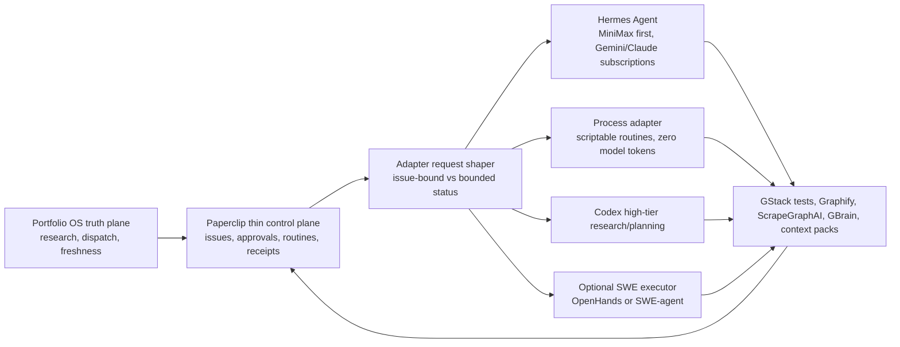

# Autonomous Software Factory Harness Evaluation

Last updated: 2026-06-17

## Decision

Do not cut over wholesale from Paperclip today. Cut Paperclip down to a thin
factory control plane and keep Hermes/Codex/provider adapters as execution
planes. The immediate production cutover is the request-shaping and final-output
gate implemented in the tokenomics fix:

- Paperclip remains the control plane for routines, issues, approvals, context
  ledger rows, run/cost receipts, execution locks, terminal-run reconciliation,
  and final-deliverable accounting.
- Portfolio OS remains the upstream truth plane for research, dispatch,
  freshness, and readiness artifacts.
- Hermes remains the primary local execution plane through Paperclip adapters,
  with MiniMax first and Gemini/Claude subscription lanes used only when the run
  is valuable enough to spend them.
- The `process` adapter is the preferred deterministic execution plane for
  routine work whose acceptance path is already a script plus tests. It must
  emit structured `PAPERCLIP_ADAPTER_RESULT_JSON` so Paperclip can post final
  comments, record receipts, and count deliverables without spending model
  tokens.
- Codex should be used as the high-intelligence research/planning lane when the
  expected output is architecture, synthesis, or plan quality rather than a
  deterministic script result.

The reason is empirical: the five-day tokenomics receipt shows the largest waste
class is not issue-bound engineering. It is no-issue/no-final-deliverable timer
or manual work: 271 runs, 189,691,316 raw tokens, 59.02 percent of burn. Shaping
that class to bounded status mode estimates 56.49 percent total savings while
leaving issue-tied work intact.

Receipt:

`/Users/mnm/Documents/Github/.paperclip/portfolio-os-cockpit/instances/default/data/ops/provider-tokenomics/runs/20260617T045052Z-hermes-tokenomics-analysis.json`

Refreshed after the deterministic process-plane canary:

`/Users/mnm/Documents/Github/.paperclip/portfolio-os-cockpit/instances/default/data/ops/provider-tokenomics/runs/20260617T090456423Z-11422-hermes-tokenomics-analysis.json`

Refreshed after the blank manual/on-demand wake guard:

`/Users/mnm/Documents/Github/.paperclip/portfolio-os-cockpit/instances/default/data/ops/provider-tokenomics/runs/20260617T090755645Z-12093-hermes-tokenomics-analysis.json`

The latest five-day read showed 370.1M raw tokens, with 54.28 percent still
classified as no-issue/no-deliverable timer or manual work. That class includes
run `f73c391c-c28a-4ba9-9692-778774993d2e`: an on-demand manual CEO wake with
no issue id, no payload, and no reason that spent about 7.0M raw tokens against
generic board context. The production rule is now that this is not a valid
provider-backed run shape. Blank manual/on-demand wakes either bind to the next
open assigned issue or record `heartbeat.idle_no_assignment` before adapter
invocation.

The implemented controls estimate at least 52 percent total savings before
additional deterministic routine conversions.

## Output Standard

The factory target is finished deliverables, not activity. Builds, accepted
patches, PRs, green local tests, and run logs are ingredients. They count only
when they roll up to one of these outcomes:

- an issue closed with a concise completion comment and relevant evidence
- a successful issue-tied artifact delivery recorded in the context ledger
- a receipt-backed research or validation artifact consumed by the next factory
  stage

Token savings cannot be achieved by suppressing the work that produces those
outcomes. The 50 percent token target must come from context selection, bounded
status checks, session isolation, tool-output ceilings, and provider routing,
not from starving implementation or verification.

## Harness Options

### Paperclip As Thin Factory Control Plane

Keep this now. Paperclip already owns the live source of truth needed for
zero-touch production operation: company/project/issue state, execution locks,
adapter selection, run logs, cost events, context-ledger rows, and operator
receipts. The problem was over-broad autonomous wakes, not the existence of the
control plane.

The target use of Paperclip is narrower than a full simulated company. For the
software factory it should behave like a governed production board: queue, lock,
route, receipt, and decide final disposition. CEO/CMO/CFO-style roles can still
exist where they create real product or go-to-market artifacts, but generic
organizational chatter should not be a recurring provider workload.

Cutover shape:

- Disable or shape company-style timer loops that have no explicit issue,
  comment, approval, or human prompt.
- Pin timer and blank manual/on-demand wakes with assigned open work to the next
  issue before adapter launch; if there is no assigned work, skip before
  provider invocation.
- For timer-pinned continuations, skip before provider invocation when the
  latest same-agent issue receipt explicitly says there is no new signal, no
  state change, and no work product, and no newer external signal exists. This
  is the harness-level form of the Ponytail question: "Does this session's prior
  run provide value to the current wake?"
- For timer-pinned triage/intake continuations, skip before provider invocation
  when there is no inbound user/comment payload and no later external signal.
  The Council run `b5368eb6-17c0-48f0-bd6b-7dbade86d7ca` on `PORA-1548` spent
  550,909 raw tokens to decide `NO_NEW_TRIAGE_INPUT`; this is not Hermes work.
  It is a Paperclip control-plane close with `heartbeat.no_inbound_triage_signal`.
- For timer-pinned continuations whose latest same-agent receipt says heartbeat
  budget was exhausted, the deliverable was not written, or the agent must stop
  calling tools, skip automatic timer recursion with
  `heartbeat.timer_budget_exhausted_requires_handoff`. Leave the issue open and
  require a deliberate handoff, newer signal, or different execution lane. This
  preserves full budgets for fresh issue-bound work without letting partial
  runs respawn themselves indefinitely.
- Keep issue-bound assignment and automation work on the full build/research
  budget.
- Reconcile terminal issue state back into running local-agent processes so
  done/cancelled work cannot keep spending execution time.
- Route commandable routine work through the process adapter before Hermes. The
  Evidence Backfill Reconciler cutover proved the pattern on run
  `2f1e3183-c754-446b-9728-05c49f75ef44`: it refreshed the Portfolio OS receipt,
  ran the issue-specific test file, posted the final Paperclip issue comment,
  and recorded `usageJson=null`.
- Route Dispatch Poller work through the process adapter as well. Run
  `8a785eaf-ad2d-49ca-8f8a-b79a36b23ce3` proved the class still produced a real
  final deliverable, but spent 885,875 raw MiniMax tokens on deterministic hash
  and branch parity checks. Dispatch Poller contracts now infer a process
  override from `routine_key: "dispatch-poller"` and run
  `scripts/process-runbooks/dispatch-poller-runner.mjs`, preserving the final
  parity report while reducing provider tokens for that class to zero. Existing
  open Dispatch Poller WIP is also backfilled during coalescence, so issues
  created before the cutover do not keep their old Hermes path.
- Route Release Gate Reconciler work through the process adapter when the target
  repo already has a native release gate. The Hermes run
  `bd240e51-b927-4eac-827e-1b467380ac68` used MiniMax to discover that
  `PORAA-2821` needed `npm run release:gate`; the process cutover made that the
  actual execution plane. `routine_key: "release-gate-reconciler"` now runs
  `scripts/process-runbooks/release-gate-runner.mjs`, writes a release-gate
  artifact, patches the issue to `done` or `blocked`, and spends zero provider
  tokens.
- Route Skill Inventory maintenance through the process adapter. The live
  Skill Curator run `fba116d1-3bd7-4a1e-a4ec-75af1ffe044d` on `PORA-1801`
  spent 524,037 raw tokens to rediscover a mechanical failure: 43 Portfolio OS
  skills lacked `keywords:` frontmatter while `scripts/skill_curator.py`
  already supplied the validation contract. The `skill_sync` routine contract
  now infers a process override for `Skill Inventory :: Curate And Sync` and
  runs `scripts/process-runbooks/skill-inventory-runner.mjs`, which repairs the
  metadata, reruns the curator, and patches the issue with
  `providerTokensSpent=0`. Live process run
  `48299aab-5161-4051-b18c-dda3f50ed83e` proved the cutover by closing
  `PORA-1801`, repairing 43 skills, moving the curator report from
  `pass=10/fail=43` to `pass=53/fail=0`, and spending zero provider tokens.
- Treat final deliverables as completed issues or successful issue-tied
  artifact receipts, not accepted patches, PRs, build runs, or status logs.
- Require the Ponytail-style context gate before prior-session replay: "Does
  this session's prior runs provide any value to this current run?" If not, use
  only compact current issue/context-ledger evidence.

### Temporal Durable Execution

Temporal is the strongest candidate for a future reliability substrate where
Paperclip has historically lost processes or needed manual recovery. Temporal
positions Workflow Execution as durable, reliable, scalable function execution,
and its docs say workflows resume after crashes, network failures, and outages.

Use it if Paperclip needs stronger guarantees for long-running orchestration,
retries, process-loss recovery, and exactly-once-ish workflow state. Do not use
it as the agent brain. It should wrap queues and recovery, not replace issue
contracts or final-deliverable accounting.

Sources: [Temporal docs](https://docs.temporal.io/), [Workflow Execution overview](https://docs.temporal.io/workflow-execution)

### OpenHands / Software Agent SDK

OpenHands is a credible specialized software-engineering execution plane. Its
public site describes autonomous agents that plan, write, and apply changes
across a codebase, and its SDK repo describes local or ephemeral workspaces for
one-off tasks, maintenance, and multi-agent refactors.

Use it as a candidate executor for GitHub issue implementation after it can emit
Paperclip-compatible receipts: changed files, tests, blockers, artifact refs,
costs, and final issue disposition. Do not replace Paperclip governance with it
until it can preserve the current cockpit ledger contract.

Sources: [OpenHands](https://openhands.dev/), [OpenHands Software Agent SDK](https://github.com/OpenHands/software-agent-sdk)

### SWE-agent / mini-swe-agent

SWE-agent is a strong issue-fix harness for real GitHub repositories. Its docs
describe autonomous tool use to fix GitHub issues, cybersecurity vulnerabilities,
or custom tasks, and emphasize a configurable, hackable setup. mini-swe-agent is
especially attractive as a minimal deterministic executor where Paperclip can
own the issue contract and the harness owns the repo patch loop.

Use it for issue-scoped coding tasks when the run can be represented as:
repository + issue + acceptance criteria + tests + final diff. Do not use it for
portfolio/company strategy, multi-plane research synthesis, or cockpit state
management.

Sources: [SWE-agent docs](https://swe-agent.com/latest/), [mini-swe-agent](https://github.com/SWE-agent/mini-swe-agent)

### Dagster

Dagster is relevant for the research/artifact pipeline, not for coding-agent
execution. Its current positioning is asset-centric orchestration with lineage,
quality signals, dependency context, scheduling, and monitoring. That maps well
to Portfolio OS research artifacts, ScrapeGraphAI extractions, Graphify outputs,
GStack validation receipts, and GBrain indexes.

Use it only if the factory needs asset lineage and data-quality observability
that Paperclip receipts cannot provide. It is not the right direct replacement
for Hermes execution.

Sources: [Dagster](https://dagster.io/), [software-defined assets](https://dagster.io/blog/software-defined-assets)

## Recommended Target Architecture

## Work Placement

- Portfolio OS: research selection, dispatch authority, freshness/readiness
  artifacts, and upstream evidence that determines what the factory should build.
- Paperclip: issue/routine governance, execution locks, approvals, context
  ledgers, provider capacity, cost events, and final-deliverable accounting.
- Process adapter: deterministic script/test execution for recurring factory
  tasks that can already prove success without model reasoning.
  Current cutovers: Evidence Backfill Reconciler, Dispatch Poller, and Release
  Gate Reconciler, and Skill Inventory. The live
  Dispatch Poller WIP canary upgraded `PORAA-3194` from no adapter override to
  `adapterType=process` with no heartbeat/provider run:
  `/Users/mnm/Documents/Github/.paperclip/portfolio-os-cockpit/instances/default/data/ops/provider-tokenomics/runs/20260617T094836Z-dispatch-poller-process-coalesce-live-canary.json`
  The follow-on execution canary closed that same issue through the process
  adapter, posted a final parity comment, wrote the YT-Synth report/payload
  artifacts, and spent zero provider tokens:
  `/Users/mnm/Documents/Github/.paperclip/portfolio-os-cockpit/instances/default/data/ops/provider-tokenomics/runs/20260617T095412Z-dispatch-poller-process-execution-live-canary.json`
  The Release Gate Reconciler canary closed `PORAA-2821` through
  `scripts/process-runbooks/release-gate-runner.mjs` after YT-Synth commit
  `23e70213fb3a76dbbd0e2f96c9d6c71d53e19967`; Paperclip run
  `8a446626-05e0-49dd-adaf-51dc1dc7253b` recorded `usageJson=null`,
  `providerTokensSpent=0`, and a final `done` issue status.
  The Skill Inventory runbook is covered by `skill-inventory-runbook.test.ts`
  and `routines-service.test.ts`; live execution should be allowed to repair
  `.agents/skills/*/SKILL.md` and regenerate `reports/skills/latest.md`, but it
  should not broad-stage or commit unrelated dirty Portfolio OS files.
- Hermes: local implementation and research execution when the task needs
  tools, repo access, Paperclip context, and provider routing.
- Codex: top-tier architecture, planning, red-team review, and synthesis where
  non-deterministic reasoning is more valuable than a deterministic script.
- Optional future executor: OpenHands or mini-SWE-agent for tightly scoped GitHub
  issue implementation after it can emit Paperclip-compatible receipts.
- Temporal: reliability substrate for durable queue/retry/process-loss recovery
  if Paperclip's current heartbeat runner keeps losing local processes.
- Dagster: asset lineage for Portfolio OS, ScrapeGraphAI, Graphify, GStack, and
  GBrain research artifacts if receipts become too hard to audit inside
  Paperclip alone.

## Cutover Rules

- No explicit issue/comment/approval/human prompt or explicit reason: first try
  to bind to assigned open work; if none exists, skip before adapter invocation.
- Timer-bound assigned work whose newest same-agent receipt says "skip until
  new state" must record `heartbeat.no_new_issue_signal` unless a newer external
  comment or issue update exists.
- Timer-bound triage/intake work with no inbound user/comment payload must
  record `heartbeat.no_inbound_triage_signal`, close the empty triage issue, and
  avoid all provider-backed adapter work.
- Timer-bound assigned work whose newest same-agent receipt says budget was
  exhausted without a deliverable must record
  `heartbeat.timer_budget_exhausted_requires_handoff`, keep the issue open, and
  avoid automatic provider-backed recursion until a newer signal or explicit
  handoff exists.
- No explicit issue/comment/approval/human prompt but an intentional system
  reason: bounded status mode only, 8,000 context chars, 1,200 output chars,
  six sentences, four turns.
- Explicit issue/comment/approval/human prompt: preserve full role budget and
  require a final deliverable.
- Scriptable issue with known command/test acceptance: prefer `process` with
  structured result JSON over Hermes. This is not a downgrade; it is the
  correct execution plane when the final deliverable is deterministic.
- Prior-run context is opt-in per run. The required question is: “Does this
  session's prior runs provide any value to this current run?”
- If the answer is no, the agent must use compact current Paperclip evidence and
  ignore prior-session replay.
- If a local execution plane does resume, the session must carry a matching
  Paperclip work key for the current issue/task/comment. A legacy or mismatched
  session is context rot: start a fresh run-owned session without lowering the
  role budget for real issue-bound work.
- A run cannot satisfy the 90 percent output target unless it closes issue work
  or records successful issue-tied artifact delivery.
- Alternative executors are allowed only after they can write Paperclip-compatible
  receipts and preserve cost accounting.
- For pure software-factory work, avoid recurring company-role prompts unless
  they produce a deliverable artifact or a concrete issue-routing decision.

## Caveats

- Temporal would improve durability, but adopting it introduces a second
  workflow runtime and migration work for heartbeat/run state.
- OpenHands and SWE-agent may be better coding executors for some issue classes,
  but neither should bypass Paperclip issue locks, approval gates, cost events,
  or final-disposition receipts.
- Dagster is useful if research artifacts need asset lineage; it would not solve
  provider token waste or lost CLI processes by itself.
- Codex is now strong enough to own more architecture and planning work, but it
  still needs a receipt bridge into Paperclip or Portfolio OS before it can be
  considered an unsupervised production plane.
- The remaining tokenomics misses should be handled as control-plane shape
  problems before adding more global caps. The CMO no-new-signal class is now
  covered by `heartbeat.no_new_issue_signal`; the Council empty-triage class is
  covered by `heartbeat.no_inbound_triage_signal`; the issue-bound
  budget-exhausted partial class is covered by
  `heartbeat.timer_budget_exhausted_requires_handoff`. Future misses should
  first ask whether the wake contains a real deliverable signal before spending
  Hermes, Gemini, Claude, MiniMax, or Codex tokens.
- The current remaining proof gap is output throughput, not token burn. The
  strict post-fix 30-minute receipt at
  `/Users/mnm/Documents/Github/.paperclip/portfolio-os-cockpit/instances/default/data/ops/provider-tokenomics/runs/20260617T112358863Z-76584-hermes-tokenomics-watch.json`
  had zero raw tokens and zero high-burn events but failed the 90 percent output
  lift because the interval only produced one final-deliverable unit. Do not
  solve this by re-enabling broad company-role timers. Solve it by routing real
  open assigned work through issue-bound Hermes/Codex runs or process runbooks
  that produce completed issues or issue-tied artifacts.
- Do not count a "successful" run as output when the issue comment says only
  context was loaded, no API mutations were made, or the next timer should
  resume the work. Run `6d3dcd5c-1412-434f-bac7-b0c3dd7b1650` on `PORAA-3211`
  is the reference failure: 509,585 raw tokens, run status `succeeded`, and no
  deliverable. The correct harness behavior is `heartbeat.no_new_issue_signal`
  until a newer external signal exists.
- The broad agent-autonomy recovery op should not be applied blindly. Its dry
  run at
  `/Users/mnm/Documents/Github/.paperclip/portfolio-os-cockpit/instances/default/data/ops/agent-autonomy-recovery/runs/20260617T1126476Z.json`
  would reset one stale error agent but also re-enable 11 timer heartbeats,
  including LeadForge timers that were intentionally disabled. A narrower
  company allowlist or explicit issue-bound recovery path is required.
- After the timer-budget-exhausted handoff gate was loaded, the immediate
  five-minute receipt at
  `/Users/mnm/Documents/Github/.paperclip/portfolio-os-cockpit/instances/default/data/ops/provider-tokenomics/runs/20260617T113852408Z-83020-hermes-tokenomics-watch.json`
  showed zero raw tokens, zero high-burn events, zero drift, and MiniMax
  available. It was correctly `warn`, not `pass`, because that short post-restart
  window had no final deliverable units. The next production proof must be a
  work-bearing window that both avoids the partial-recursion class and finishes
  issues or issue-tied artifacts.
